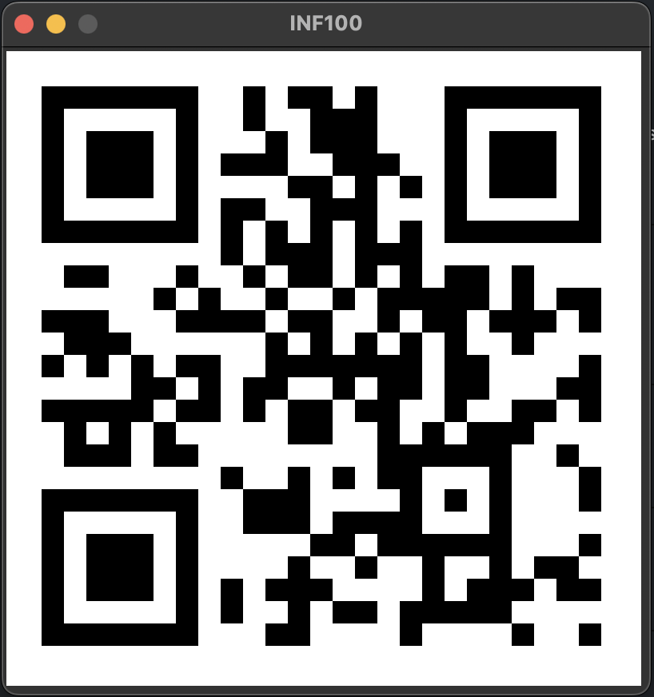

# QR URL CODE GENERATOR.

## Project Description

This project is designed to convert a URL or any other string into a QR code that can be easily scanned by various devices such as smartphones and tablets. The QR code version implemented in this project is QRv2, which is an enhanced version of the original QR code standard.

### Key Features of the Project

- **Versatile Input**: The project can handle various types of input, including URLs, plain text, and other string-based data formats.
- **Enhanced QR Code Version**: Utilizes QRv2, which offers increased data capacity, improved error correction, and alignment patterns for better readability.
- **User-Friendly**: The process of generating a QR code is straightforward, requiring minimal user input.
- **Image Output**: The generated QR code is shown as a separate window on the running host system.

### How It Works

1. **Input Handling**: The user provides a string input, which can be a URL or any other type of data.
2. **QR Code Generation**: The input string is processed and encoded into a QRv2 format, leveraging its advanced features.
3. **Error Correction**: Error correction codes are added to ensure the QR code remains readable even if partially damaged.
4. **Image Creation**: The final QR code is rendered as an image in a separate window, which can be saved and shared.

## What is QRv2?

QRv2, also known as QR Code Model 2, is an updated version of the original QR code standard. It includes several enhancements over the original model, such as:

- **Increased Data Capacity**: QRv2 can store more data compared to the original QR code.
- **Error Correction**: QRv2 includes improved error correction capabilities, allowing the QR code to be read even if it is partially damaged.
- **Alignment Patterns**: QRv2 includes alignment patterns that help in accurately reading the QR code, even if it is distorted.

### Stages of QR Code Generation

1. **Data Encoding**: The input string is encoded into a binary format.
2. **Error Correction Coding**: Error correction codes are added to the binary data to ensure the QR code can be read even if it is partially damaged.
3. **Structure Final Message**: The encoded data and error correction codes are structured into a final message.
4. **Module Placement**: The final message is placed into the QR code matrix.
5. **Masking**: A mask pattern is applied to the QR code to ensure it can be read under various lighting conditions.
6. **Format and Version Information**: Information about the QR code's format and version is added to the matrix.

## Screenshots



## Requirements

This project requires mainly two libraries, being the UiB INF100 graphics library, and ReedSolo. The project has been tested to work, as of 12.11.2024, on both Windows, and MacOS, with uncertaincy surround the Linux ecosystem.

To install the required packages you can run the following commands:

```sh
pip3 install reedsolo
pip3 install uib_inf100_graphics
```

## How to Run

After cloning the repository you just need to modify the URL specified in main.py, and then run main.py.

Run the main script:

```sh
python main.py
```
